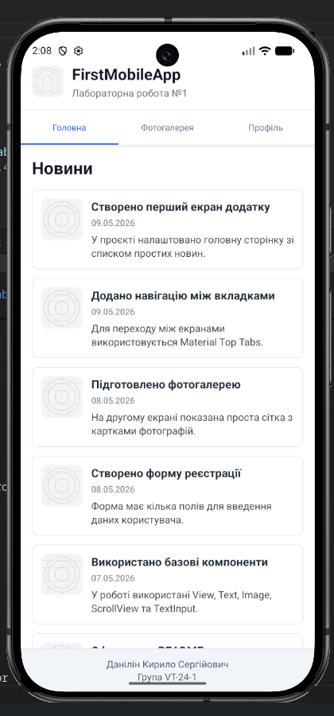
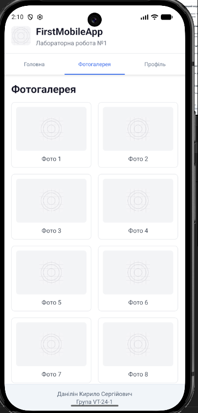
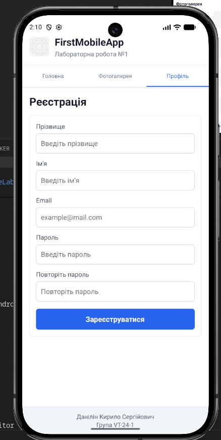

# Лабораторна робота №1

## Дані студента

- ПІБ: Данілін Кирило Сергійович
- Група: VT-24-1
- Підгрупа: 1
- Репозиторій: MobileLabsRN2026
- Лабораторна: lab1

## Тема роботи

Використання Expo для створення найпростішого додатку React Native. Знайомство з основними компонентами.

## Мета роботи

Навчитися створювати та налаштовувати проєкт у середовищі Expo, ознайомитися зі структурою React Native застосунку та опанувати навички роботи з базовими компонентами.

## Завдання

- створити простий Expo / React Native застосунок;
- запустити його на Android Emulator;
- реалізувати простий мобільний інтерфейс;
- використати базові компоненти React Native;
- додати README.md з інструкцією запуску, описом функціоналу, скріншотами і висновком.

## Опис реалізованого застосунку

У лабораторній роботі створено простий мобільний застосунок `FirstMobileApp`. У ньому є верхній блок `Header`, нижній блок `Footer` та навігація між трьома вкладками за допомогою Material Top Tabs.

Реалізовані екрани:

- `Головна` - екран зі списком новин. Кожна новина має назву, дату, короткий опис і зображення.
- `Фотогалерея` - екран з простою сіткою карток фотографій. Зараз для прикладу використовується іконка застосунку.
- `Профіль` - екран реєстрації з полями для прізвища, імені, email, пароля і повторення пароля. Після натискання кнопки показується повідомлення через `Alert`.

У `Header` показується логотип, назва застосунку та номер лабораторної роботи. У `Footer` виводяться ПІБ студента і група.

## Використані технології

- React Native
- Expo
- JavaScript
- React Navigation
- Material Top Tabs
- Android Emulator
- StyleSheet

## Використані компоненти React Native

У коді застосунку використані такі базові компоненти React Native:

- `View` - для контейнерів і блоків інтерфейсу;
- `Text` - для заголовків, описів, підписів і тексту кнопки;
- `Image` - для логотипу та зображень у новинах і галереї;
- `ScrollView` - для прокручування вмісту екранів;
- `TextInput` - для полів форми реєстрації;
- `TouchableOpacity` - для кнопки реєстрації;
- `StyleSheet` - для оформлення стилів;
- `Alert` - для показу простого повідомлення після натискання кнопки.

Також використовується `StatusBar` з пакета `expo-status-bar`.

## Структура проєкту

```text
lab1/
├── .gitignore
├── App.js
├── README.md
├── app.json
├── assets/
│   ├── adaptive-icon.png
│   ├── favicon.png
│   ├── icon.png
│   └── splash-icon.png
├── components/
│   ├── Footer.js
│   └── Header.js
├── index.js
├── package-lock.json
├── package.json
├── screens/
│   ├── GalleryScreen.js
│   ├── HomeScreen.js
│   └── ProfileScreen.js
└── screenshots/
    ├── .gitkeep
    ├── galery.png
    ├── main.png
    └── profile.png
```

## Інструкція запуску

Перейти в папку лабораторної роботи:

```bash
cd ~/Work/University/2-Kyrs-2-Semestr/MobileLabsRN2026/lab1
```

Встановити залежності:

```bash
npm install
```

Запустити Expo:

```bash
npx expo start --localhost
```

Після запуску Expo у терміналі потрібно натиснути клавішу:

```text
a
```

Це відкриє застосунок на Android Emulator.

## Запуск Android Emulator

Якщо емулятор ще не відкритий, його можна запустити командою:

```bash
$HOME/Android/Sdk/emulator/emulator -avd Pixel_9
```

Якщо Android Emulator вже відкритий, достатньо запустити Expo і натиснути клавішу `a`.

## Скріншоти роботи застосунку

У папці `lab1/screenshots` додані скріншоти основних екранів застосунку.

### Головна сторінка

На цьому екрані відображено головну сторінку застосунку з переліком новин. Реалізовано простий список елементів із заголовками, датою, коротким описом та зображенням.



### Фотогалерея

На цьому екрані показано сторінку фотогалереї. Елементи розміщені у вигляді простої сітки з картками та зображеннями.



### Профіль / Реєстрація

На цьому екрані показано сторінку реєстрації користувача. Реалізовано поля введення даних та кнопку для взаємодії з формою.



## Висновок

Під час виконання лабораторної роботи я навчився створювати простий Expo-проєкт і запускати React Native застосунок на Android Emulator. Також я попрацював з базовими компонентами React Native, стилями через `StyleSheet` і простою навігацією між екранами. У результаті вийшов невеликий застосунок з головною сторінкою, фотогалереєю та формою реєстрації.
