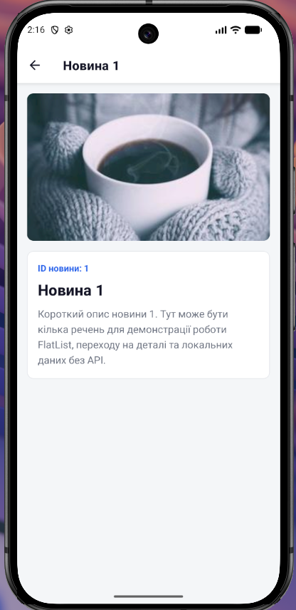
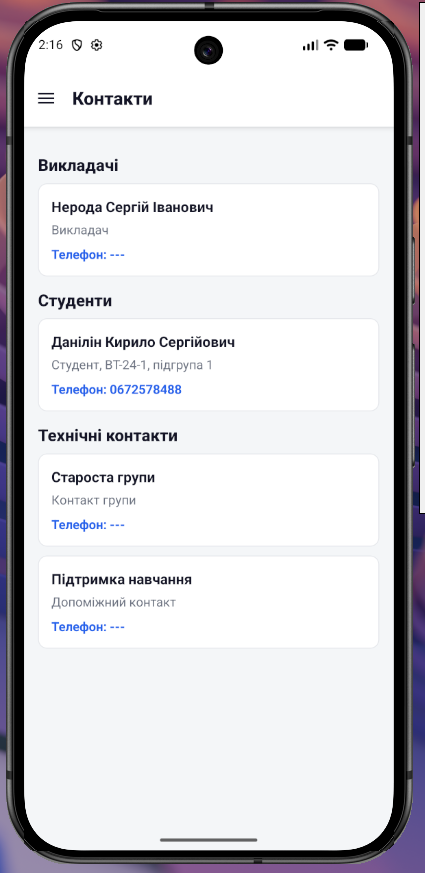
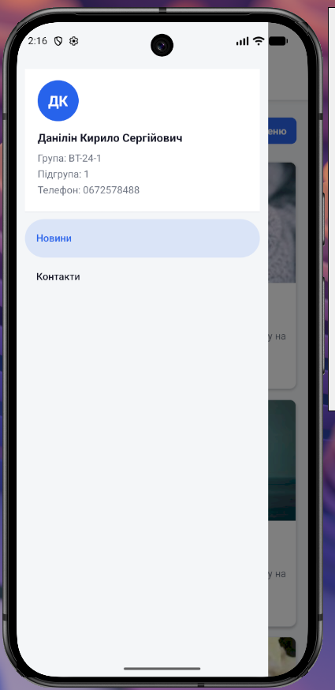

# Лабораторна робота №2

## Тема
Побудова вкладеної навігації та оптимізація відображення великих списків у React Native із використанням компонентів FlatList та SectionList.

## Студент
Данілін Кирило Сергійович  
Група: ВТ-24-1  
Підгрупа: 1  

## Мета роботи
Мета роботи полягає в тому, щоб навчитися будувати вкладену навігацію в React Native, поєднувати Drawer Navigator і Stack Navigator, передавати дані між екранами та відображати великі списки за допомогою FlatList і SectionList з базовою оптимізацією.

## Завдання
- реалізувати вкладену навігацію;
- налаштувати Drawer Navigator;
- налаштувати Stack Navigator;
- створити головний екран зі списком новин;
- використати FlatList для відображення новин;
- додати Pull-to-Refresh;
- додати Infinite Scroll;
- створити екран деталей новини;
- реалізувати передачу параметрів між екранами;
- додати динамічний заголовок екрану деталей;
- створити екран контактів через SectionList;
- реалізувати кастомне бокове меню Drawer.

## Використані технології
- React Native;
- Expo;
- JavaScript;
- React;
- React Navigation;
- Drawer Navigator `@react-navigation/drawer`;
- Native Stack Navigator `@react-navigation/native-stack`;
- React Native Gesture Handler;
- React Native Reanimated;
- React Native Screens;
- React Native Safe Area Context;
- Expo StatusBar;
- FlatList;
- SectionList.

## Структура проєкту
Файли лабораторної роботи розміщені у папці `lab2`. Сам Expo-проєкт знаходиться у вкладеній папці `lab2/lab2`, а папка `lab2/screenshots` підготовлена для зображень результату роботи.

```text
lab2/
├── README.md
├── screenshots/
│   ├── main.png
│   ├── details.png
│   ├── contacts.png
│   └── drawer.png
└── lab2/
    ├── App.js
    ├── app.json
    ├── babel.config.js
    ├── eslint.config.js
    ├── index.js
    ├── package.json
    ├── package-lock.json
    ├── assets/
    │   └── images/
    ├── scripts/
    │   └── reset-project.js
    └── src/
        ├── components/
        │   ├── CustomDrawerContent.js
        │   └── NewsCard.js
        ├── data/
        │   ├── contacts.js
        │   └── news.js
        ├── navigation/
        │   ├── AppDrawer.js
        │   └── NewsStack.js
        ├── screens/
        │   ├── ContactsScreen.js
        │   ├── DetailsScreen.js
        │   └── MainScreen.js
        └── styles/
            └── colors.js
```

## Опис реалізації
У файлі `App.js` застосунок обгорнуто в `GestureHandlerRootView`, підключено `AppDrawer` і встановлено `StatusBar`. Основна навігація винесена в `src/navigation/AppDrawer.js`, де створено Drawer Navigator з двома пунктами: екраном новин та екраном контактів.

Вкладена навігація реалізована через `src/navigation/NewsStack.js`. Drawer Navigator відкриває `NewsStack`, а всередині Stack Navigator є два екрани: `Main` для списку новин і `Details` для перегляду однієї новини. Заголовок екрана деталей формується з назви переданої новини.

Головний екран `src/screens/MainScreen.js` використовує `FlatList` для відображення списку новин. Дані генеруються функцією `generateNews` з файлу `src/data/news.js`. Для оптимізації списку використано параметри `initialNumToRender`, `maxToRenderPerBatch` і `windowSize`.

Pull-to-Refresh реалізовано через властивості `refreshing` та `onRefresh` компонента `FlatList`. Infinite Scroll реалізовано через `onEndReached`, `onEndReachedThreshold` і функцію `loadMoreNews`, яка додає наступну порцію новин до поточного списку.

Картка новини винесена в компонент `src/components/NewsCard.js`. При натисканні на картку виконується перехід `navigation.navigate('Details', { news: item })`, тобто на екран деталей передається об'єкт новини.

Екран `src/screens/DetailsScreen.js` отримує дані через `route.params?.news` і показує зображення, ідентифікатор, заголовок та опис новини. Якщо параметри не передані, відображається повідомлення про те, що новину не знайдено.

Екран контактів `src/screens/ContactsScreen.js` побудований на `SectionList`. Дані беруться з `src/data/contacts.js` і згруповані за секціями: викладачі, студенти та технічні контакти.

Кастомне бокове меню реалізовано у файлі `src/components/CustomDrawerContent.js`. У ньому показано аватар з ініціалами, ПІБ студента, групу, підгрупу, телефон та список пунктів Drawer.

## Основні файли
- `lab2/lab2/App.js` - точка входу в інтерфейс застосунку.
- `lab2/lab2/src/navigation/AppDrawer.js` - налаштування Drawer Navigator.
- `lab2/lab2/src/navigation/NewsStack.js` - налаштування Stack Navigator для новин.
- `lab2/lab2/src/screens/MainScreen.js` - список новин, Pull-to-Refresh та Infinite Scroll.
- `lab2/lab2/src/screens/DetailsScreen.js` - екран деталей новини.
- `lab2/lab2/src/screens/ContactsScreen.js` - екран контактів через SectionList.
- `lab2/lab2/src/components/NewsCard.js` - компонент картки новини.
- `lab2/lab2/src/components/CustomDrawerContent.js` - кастомний вміст Drawer.
- `lab2/lab2/src/data/news.js` - генерація локальних даних новин.
- `lab2/lab2/src/data/contacts.js` - секції контактів.
- `lab2/lab2/src/styles/colors.js` - спільна палітра кольорів.

## Запуск проєкту
Для запуску потрібно перейти в папку Expo-проєкту та встановити залежності:

```bash
cd lab2/lab2
npm install
npm start
```

У `package.json` також доступні команди:

```bash
npm run android
npm run ios
npm run web
npm run lint
```

## Скріншоти роботи застосунку

### Головний екран зі списком новин


### Екран деталей новини


### Екран контактів


### Бокове меню Drawer


## Контрольні запитання

### 1. Чим FlatList відрізняється від ScrollView?
`ScrollView` рендерить усі елементи одразу, тому підходить для невеликих наборів даних. `FlatList` рендерить тільки потрібну частину списку та використовує віртуалізацію, тому краще підходить для великих списків.

### 2. Що таке віртуалізація списків?
Віртуалізація списків - це підхід, за якого на екрані створюються не всі елементи списку, а лише видимі елементи та невеликий буфер навколо них. Це зменшує навантаження на пам'ять і покращує продуктивність.

### 3. Як реалізовано передачу параметрів між екранами?
Передача параметрів виконується через `navigation.navigate('Details', { news: item })` у компоненті `NewsCard`. На екрані `DetailsScreen` ці дані отримуються через `route.params?.news`.

### 4. Для чого використовується вкладена навігація?
Вкладена навігація дозволяє поєднувати різні типи навігаторів. У цій роботі Drawer Navigator містить Stack Navigator для новин, тому користувач може відкривати бокове меню і водночас переходити між списком новин та деталями новини.

### 5. Коли доцільно використовувати SectionList?
`SectionList` доцільно використовувати, коли дані потрібно розділити на групи або секції. У цій лабораторній роботі він використаний для контактів, які поділені на викладачів, студентів і технічні контакти.

## Висновок
Під час виконання лабораторної роботи було розглянуто побудову вкладеної навігації у React Native із використанням Drawer Navigator та Native Stack Navigator. Також було реалізовано список новин через FlatList з оновленням і дозавантаженням даних, екран деталей з передачею параметрів, згрупований список контактів через SectionList та кастомне бокове меню Drawer.
