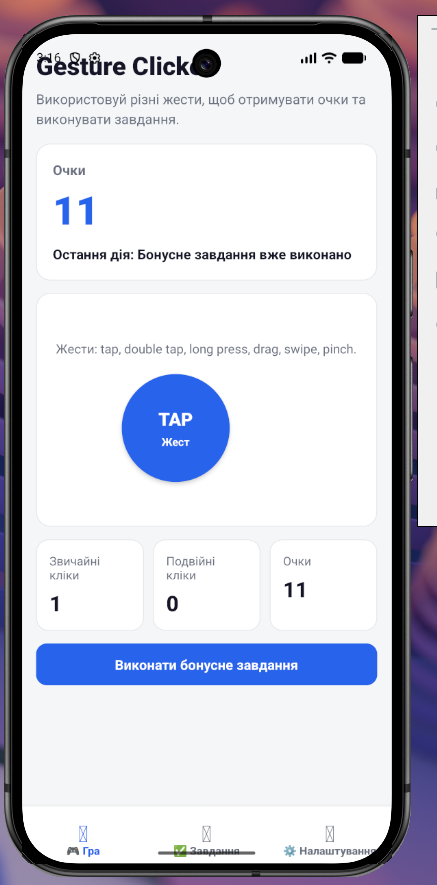
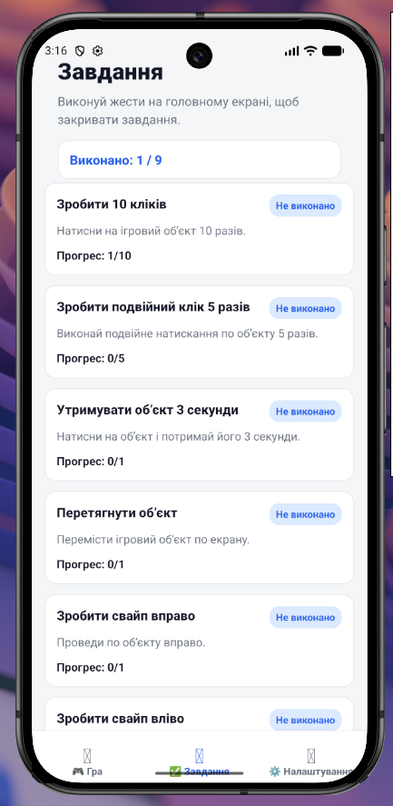
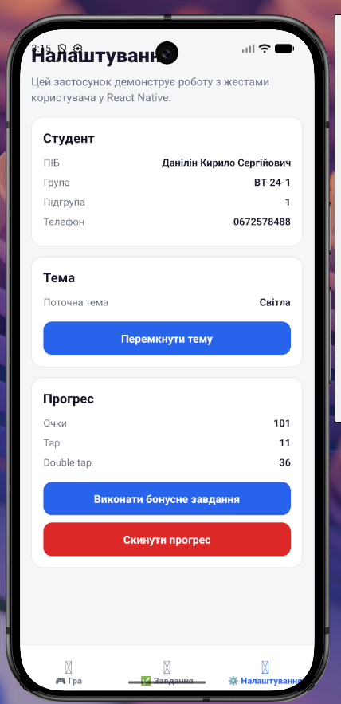
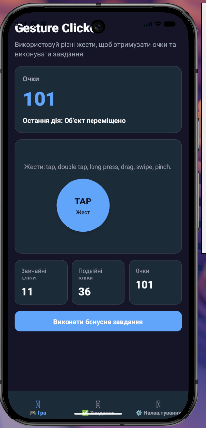
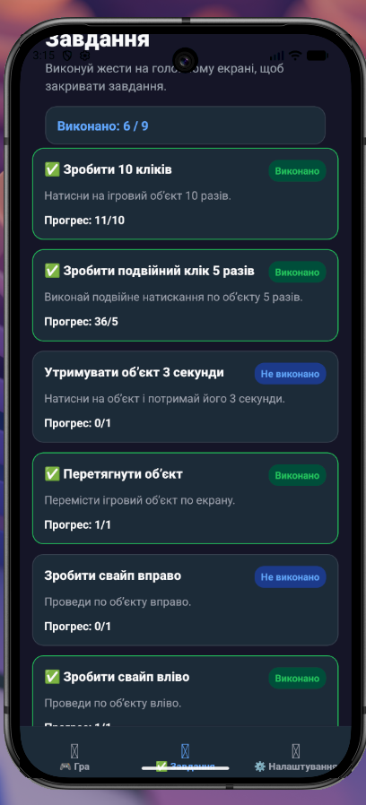
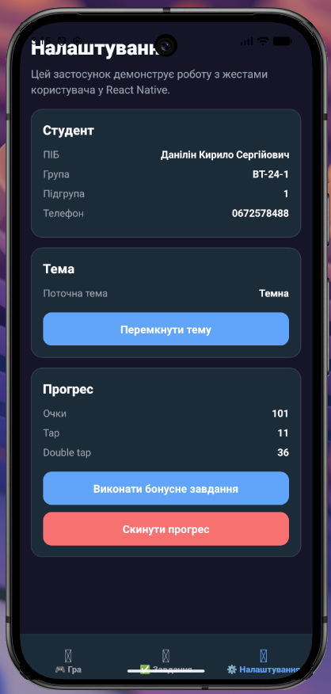
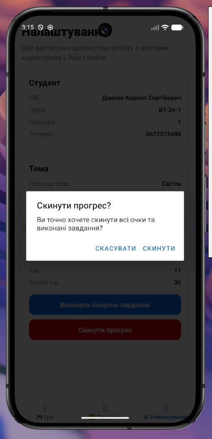
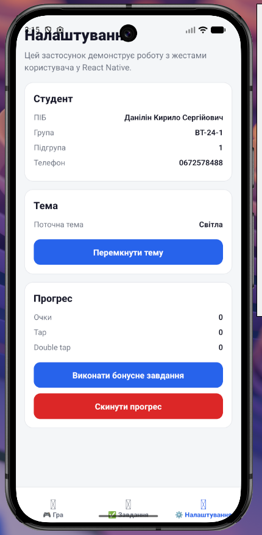

# Лабораторна робота №3

## Тема

Використання кастомних жестів у React Native та стилізація інтерфейсу мобільного застосунку.

## Студент

Данілін Кирило Сергійович  
Група: ВТ-24-1  
Підгрупа: 1

## Мета роботи

Навчитися працювати з жестами користувача у мобільному застосунку, реалізувати взаємодію через різні типи жестів та застосувати стилізацію інтерфейсу в React Native.

## Завдання

У межах лабораторної роботи потрібно було реалізувати мобільний застосунок у вигляді гри-клікера з підтримкою жестів користувача.

У застосунку потрібно було зробити:

- головний екран гри з лічильником очок;
- ігровий об'єкт, що реагує на взаємодію користувача;
- звичайне натискання;
- подвійне натискання;
- довге натискання;
- перетягування об'єкта;
- свайп вправо;
- свайп вліво;
- зміну розміру об'єкта;
- екран завдань;
- екран налаштувань;
- навігацію між екранами;
- світлу і темну тему.

## Використані технології

- React Native
- Expo
- JavaScript
- React Navigation
- Bottom Tabs
- React Native Gesture Handler
- React Native Reanimated
- Styled Components

## Структура проєкту

```text
lab3/
├── App.js
├── README.md
├── app.json
├── babel.config.js
├── index.js
├── package-lock.json
├── package.json
├── screenshots/
│   ├── .gitkeep
│   ├── challenges.png
│   ├── completed-challenges-dark.png
│   ├── dark-theme.png
│   ├── game.png
│   ├── reset-dialog.png
│   ├── settings-dark.png
│   ├── settings-reset.png
│   └── settings.png
└── src/
    ├── components/
    │   ├── ChallengeItem.js
    │   ├── GameButton.js
    │   ├── GameObject.js
    │   └── StatCard.js
    ├── context/
    │   └── GameContext.js
    ├── navigation/
    │   └── AppTabs.js
    ├── screens/
    │   ├── ChallengesScreen.js
    │   ├── GameScreen.js
    │   └── SettingsScreen.js
    ├── theme/
    │   └── theme.js
    └── utils/
        └── challenges.js
```

## Інструкція запуску

Перейти в папку лабораторної роботи:

```bash
cd ~/Work/University/2-Kyrs-2-Semestr/MobileLabsRN2026/lab3
```

Встановити залежності:

```bash
npm install
```

Запустити Expo:

```bash
npx expo start --localhost
```

Після запуску Expo у терміналі можна натиснути клавішу:

```text
a
```

Це відкриє застосунок на Android Emulator.

Якщо емулятор ще не відкритий, його можна запустити окремо:

```bash
$HOME/Android/Sdk/emulator/emulator -avd Pixel_9
```

## Опис реалізованого функціоналу

У лабораторній роботі реалізовано гру-клікер `Gesture Clicker`. Основний екран містить лічильник очок, інформацію про останню дію, круглий ігровий об'єкт `TAP`, статистику кліків та кнопку бонусного завдання.

Ігровий об'єкт реагує на такі жести:

- звичайне натискання додає очки та збільшує кількість кліків;
- подвійне натискання додає більше очок і рахується окремо;
- довге натискання зараховується як окреме завдання;
- перетягування змінює позицію об'єкта на екрані;
- свайп вправо і свайп вліво додають випадкову кількість очок;
- pinch-жест змінює розмір ігрового об'єкта.

Також у застосунку є екран `Завдання`, де показано список цілей, їхній прогрес і статус виконання. На екрані `Налаштування` виведені дані студента, поточна тема, кнопка перемикання теми, статистика прогресу, бонусне завдання та скидання прогресу.

Навігація між екранами реалізована через нижні вкладки: `Гра`, `Завдання`, `Налаштування`. Для оформлення використано `styled-components`, а кольори інтерфейсу винесені в окремі світлу і темну теми.

## Скриншоти роботи застосунку

### Головний екран гри

На цьому екрані показано гру `Gesture Clicker`: лічильник очок, останню дію, ігровий об'єкт для жестів, статистику кліків і кнопку бонусного завдання.



### Екран завдань

На екрані завдань відображено список дій, які потрібно виконати жестами. Для кожного завдання показано статус та поточний прогрес.



### Екран налаштувань

На екрані налаштувань показано дані студента, поточну тему, статистику прогресу, кнопку бонусного завдання та кнопку скидання прогресу.



### Темна тема

На цьому скриншоті показано роботу застосунку в темній темі. Інтерфейс змінює кольори фону, карток, тексту та активних елементів.



### Додаткові стани застосунку

Нижче додані ще кілька скриншотів, які показують виконані завдання, темну тему в налаштуваннях, діалог скидання прогресу та стан після скидання.









## Висновки

Під час виконання лабораторної роботи я навчився працювати з жестами у React Native та використовувати `react-native-gesture-handler`. У застосунку були реалізовані різні види взаємодії з ігровим об'єктом: tap, double tap, long press, drag, swipe та pinch. Також я попрацював з навігацією через Bottom Tabs, стилізацією через `styled-components` і перемиканням між світлою та темною темами.
