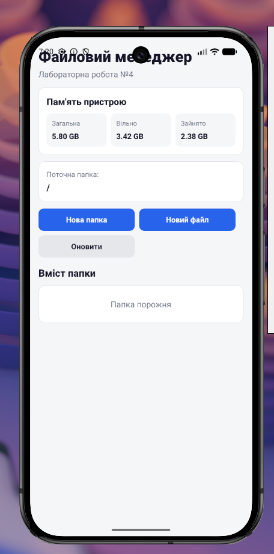
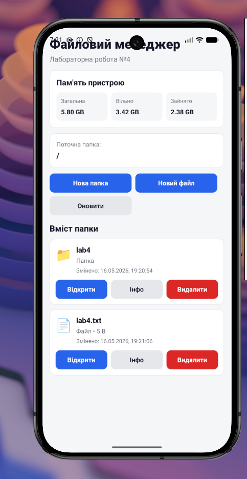
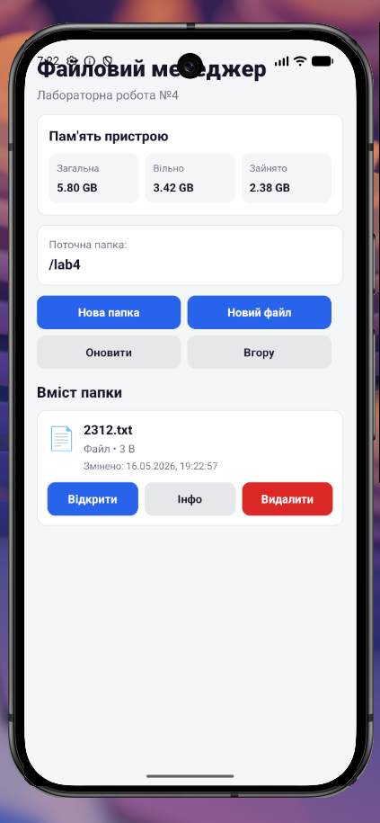
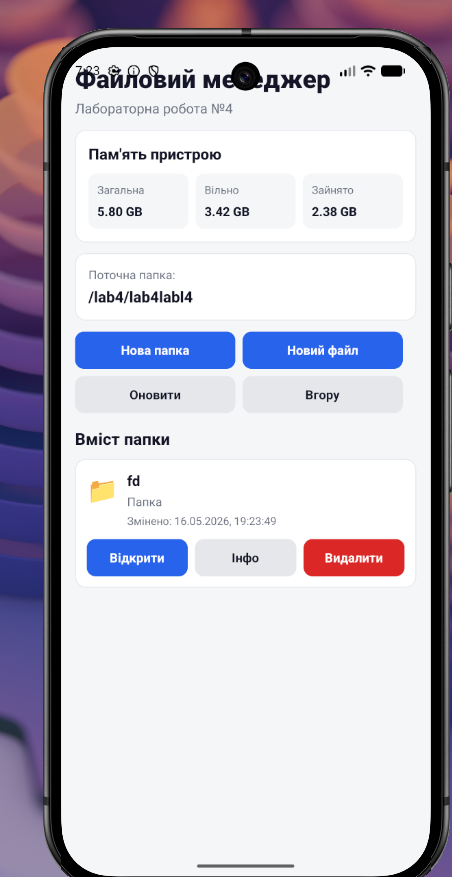
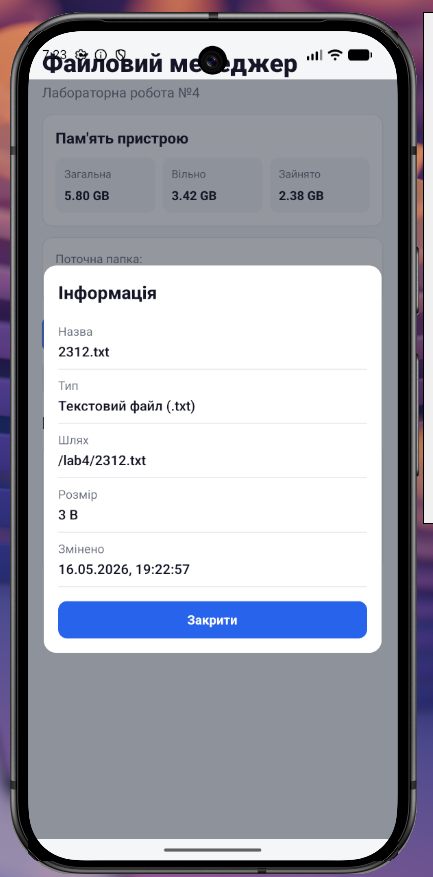
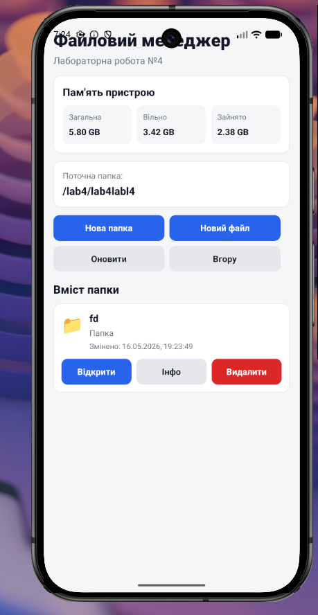

# Лабораторна робота №4

## Тема

Робота з файловою системою в React Native з використанням бібліотеки expo-file-system.

## Студент

Данілін Кирило Сергійович  
Група: ВТ-24-1  
Підгрупа: 1  

## Мета роботи

Опанувати механізми роботи з локальною файловою системою мобільного пристрою за допомогою бібліотеки `expo-file-system`, навчитися виконувати базові операції з файлами та папками, а також переглядати інформацію про об'єкти файлової системи.

## Завдання

У межах лабораторної роботи потрібно було реалізувати мобільний застосунок "Файловий менеджер", який підтримує:

- навігацію по локальній файловій системі застосунку;
- відображення поточного шляху;
- перегляд списку файлів і папок;
- перехід у вкладені папки;
- повернення до попередньої директорії;
- створення нової папки;
- створення нового текстового файлу `.txt`;
- перегляд вмісту `.txt` файлів;
- редагування текстових файлів;
- збереження змін;
- видалення файлів і папок з підтвердженням;
- перегляд детальної інформації про файл або папку;
- перегляд статистики використання пам'яті пристрою.

## Використані технології

- React Native;
- Expo;
- JavaScript;
- `expo-file-system`;
- `expo-status-bar`;
- компоненти `FlatList`, `TextInput`, `Modal`, `Alert`;
- `StyleSheet` для оформлення інтерфейсу.

## Структура проєкту

```text
lab4/
├── App.js
├── app.json
├── babel.config.js
├── index.js
├── package.json
├── package-lock.json
├── screenshots/
│   ├── main.png
│   ├── file-list.png
│   ├── empty-folder.png
│   ├── folder.png
│   ├── nested-folder.png
│   ├── editor.png
│   ├── info.png
│   └── extra-1.png
└── src/
    ├── components/
    │   ├── ActionButton.js
    │   ├── FileItem.js
    │   ├── InfoModal.js
    │   ├── MemoryStats.js
    │   └── TextInputModal.js
    ├── constants/
    │   └── colors.js
    ├── screens/
    │   └── FileManagerScreen.js
    └── utils/
        ├── fileHelpers.js
        └── formatters.js
```

## Інструкція запуску

1. Перейти до папки лабораторної роботи:

   ```bash
   cd lab4
   ```

2. Встановити залежності, якщо вони ще не встановлені:

   ```bash
   npm install
   ```

3. Запустити проєкт:

   ```bash
   npm start
   ```

4. Відкрити застосунок у Expo Go або запустити на потрібній платформі:

   ```bash
   npm run android
   npm run ios
   npm run web
   ```

## Опис реалізованого функціоналу

У застосунку реалізовано файловий менеджер, який працює з окремою локальною директорією застосунку `lab4-files` у `FileSystem.documentDirectory`. Під час запуску застосунок перевіряє наявність цієї папки і створює її, якщо вона ще не існує.

На головному екрані відображаються назва застосунку, статистика пам'яті пристрою, поточна папка, кнопки дій і список файлів та папок. Для списку використовується `FlatList`. Якщо поточна папка порожня, показується відповідне повідомлення.

Користувач може створити нову папку через модальне вікно з полем введення назви. Для створення папки використовується `FileSystem.makeDirectoryAsync`. Перед створенням перевіряється, чи назва не порожня і не містить символ `/`.

Також можна створити новий текстовий файл. У модальному вікні вводиться назва файлу та початковий вміст. Якщо користувач не вказав розширення, до назви автоматично додається `.txt`. Файл створюється за допомогою `FileSystem.writeAsStringAsync`.

Для папок доступний перехід всередину. Якщо користувач знаходиться не в кореневій папці, з'являється кнопка "Вгору", яка повертає до попередньої директорії.

Текстові файли `.txt` можна відкривати для перегляду і редагування. Вміст файлу зчитується через `FileSystem.readAsStringAsync`, після чого відкривається модальне вікно редактора з `TextInput`. Після натискання кнопки "Зберегти" зміни записуються назад у файл.

Для кожного елемента списку доступні кнопки "Відкрити", "Інфо" та "Видалити". Вікно інформації показує назву, тип, шлях, розмір і дату зміни файлу або папки. Видалення виконується після підтвердження через `Alert`, а сам файл або папка видаляється за допомогою `FileSystem.deleteAsync`.

## Скриншоти роботи застосунку

### Головний екран



### Список файлів і папок



### Порожня вкладена папка


### Папка з текстовим файлом



### Вкладена папка



### Редагування текстового файлу


### Інформація про файл



### Додатковий приклад вкладеної папки



## Висновки

Під час виконання лабораторної роботи було створено мобільний застосунок для роботи з локальною файловою системою через `expo-file-system`. У застосунку реалізовано перегляд вмісту директорій, створення папок і текстових файлів, відкриття та редагування `.txt` файлів, збереження змін, перегляд інформації про об'єкти файлової системи та видалення файлів або папок з підтвердженням.

У результаті роботи було закріплено навички використання асинхронних операцій з файловою системою, роботи з модальними вікнами, списками, полями введення та повідомленнями `Alert` у React Native.
